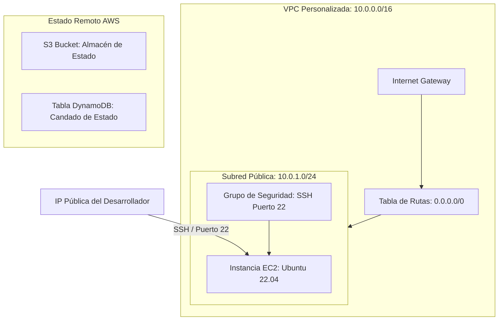

# Despliegue de Infraestructura AWS con Terraform

Este repositorio contiene la configuración de Terraform para desplegar una infraestructura básica de grado profesional en AWS. Configura un estado remoto seguro en S3 con bloqueo de estado a través de DynamoDB, y provisiona una red VPC (Virtual Private Cloud) personalizada que ejecuta un servidor web EC2.

## Diagrama de Arquitectura



## Características

- **Estado Remoto Seguro**: El archivo de estado (`.tfstate`) se almacena de forma segura, encriptado y versionado en un bucket de AWS S3.
- **Bloqueo de Estado**: Prevención de ejecuciones concurrentes gestionada dinámicamente mediante una tabla de DynamoDB para evitar corrupción de datos.
- **Topología de Red Personalizada**: Creación de una VPC aislada con subred pública, tablas de enrutamiento y pasarela de Internet (Internet Gateway).
- **Servidor Seguro**: Instancia EC2 que consulta dinámicamente la AMI oficial de Ubuntu 22.04 LTS más reciente y restringe el acceso SSH únicamente a la dirección IP pública del desarrollador.
- **Buenas Prácticas de Infraestructura como Código**: Configuración parametrizada mediante `variables.tf` y valores de retorno expuestos en `outputs.tf`.

## Estructura del Proyecto

```text
├── providers.tf         # Versión de Terraform, configuración del proveedor AWS y del backend S3
├── variables.tf         # Declaración de variables de entrada
├── outputs.tf           # Definición de outputs de salida del despliegue
├── terraform.tfvars.example # Plantilla de variables (renombrar a terraform.tfvars y rellenar)
├── main.tf              # Definición de recursos (VPC, Subred, EC2, S3, DynamoDB)
└── .gitignore           # Reglas de exclusión de Git para proteger archivos sensibles
```

## Cómo Ejecutar este Proyecto

### 1. Requisitos Previos
- [Terraform CLI](https://developer.hashicorp.com/terraform/downloads) (versión >= 1.5.0) instalado localmente.
- [AWS CLI](https://aws.amazon.com/cli/) configurado con credenciales de IAM válidas.

### 2. Configurar Variables
Renombra la plantilla de variables y edítala con tus propios parámetros de red y nombres de recursos únicos:
```bash
cp terraform.tfvars.example terraform.tfvars
```

### 3. Inicializar el Directorio de Trabajo
Descarga los proveedores necesarios y prepara el entorno local:
```bash
terraform init
```

### 4. Crear los Recursos de Red e Infraestructura
Ejecuta la validación y despliega la VPC, el bucket S3 y la tabla DynamoDB:
```bash
terraform validate
terraform plan
terraform apply
```

### 5. Migrar el Estado al Backend Remoto en S3
Descomenta el bloque `backend "s3"` en el archivo `providers.tf` y ejecuta la migración automática:
```bash
terraform init
```

### 6. Verificar la Conexión
Prueba la conectividad SSH al puerto 22 del servidor EC2 usando PowerShell:
```powershell
Test-NetConnection -ComputerName <IP_PUBLICA_EC2> -Port 22
```
