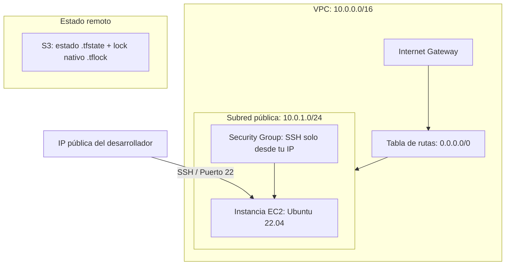

# Infraestructura AWS con Terraform (proyecto de aprendizaje)

Proyecto **modular** de Terraform para desplegar una infraestructura básica de
grado profesional en AWS:

- **Estado remoto** seguro en S3 (cifrado + versionado) con **bloqueo nativo de S3** (`use_lockfile`, sin DynamoDB).
- **Red** propia: VPC con subred pública, Internet Gateway y tabla de rutas.
- **Cómputo**: instancia EC2 (Ubuntu 22.04) con acceso SSH restringido a tu IP.

Todo está organizado en **módulos reutilizables** dentro de `modules/`, que es la
forma más clara de aprender Terraform: cada módulo resuelve una cosa y el
`main.tf` raíz solo los conecta.

## Diagrama de arquitectura



## Estructura del proyecto

```text
.
├── providers.tf              # Versión de Terraform, proveedor AWS y backend S3
├── main.tf                   # Root: solo "llama" a los módulos y los conecta
├── variables.tf              # Declaración de variables de entrada
├── outputs.tf                # Salidas del despliegue
├── terraform.tfvars          # Tus valores reales (NO se sube a git)
├── terraform.tfvars.example  # Plantilla para crear terraform.tfvars
├── moved.tf                  # Temporal: migración de recursos a módulos (ver nota)
└── modules/
    ├── state-backend/        # Bucket S3 con lock nativo (estado remoto)
    ├── networking/           # VPC, subred, internet gateway, rutas
    └── compute/              # Security Group + instancia EC2
```

Cada módulo sigue la misma convención: `main.tf` (recursos), `variables.tf`
(entradas), `outputs.tf` (salidas) y su propio `README.md`.

## Cómo usar este proyecto

### 1. Requisitos previos
- [Terraform CLI](https://developer.hashicorp.com/terraform/downloads) >= 1.5.0
- [AWS CLI](https://aws.amazon.com/cli/) con credenciales válidas configuradas

### 2. Configurar variables
```bash
cp terraform.tfvars.example terraform.tfvars
# Edita terraform.tfvars: pon tu IP pública en ssh_allowed_cidr (curl ifconfig.me)
```

### 3. Inicializar
```bash
terraform init
```

### 4. Revisar y aplicar
```bash
terraform fmt        # formatea el código
terraform validate   # valida la sintaxis
terraform plan       # muestra qué cambiará (no aplica nada)
terraform apply      # crea/actualiza la infraestructura
```

### 5. Verificar la conexión SSH
```bash
ssh -i ~/.ssh/tu_clave ubuntu@$(terraform output -raw ec2_public_ip)
```

## Nota sobre `moved.tf`

Este proyecto migró sus recursos desde un único `main.tf` monolítico a módulos.
Los bloques `moved` reubican los recursos en el estado **sin destruirlos**. Una
vez ejecutado `terraform apply` con la migración aplicada, `moved.tf` se puede
borrar sin problema.

## Nota sobre el VPS de desarrollo

El VPS de AWS Lightsail desde el que se trabaja **no** lo gestiona este proyecto
de Terraform, y es intencionado: una máquina de gestión no debería gestionarse a
sí misma con el mismo estado que ejecuta sobre ella. Se administra aparte (consola
de Lightsail / AWS CLI).
