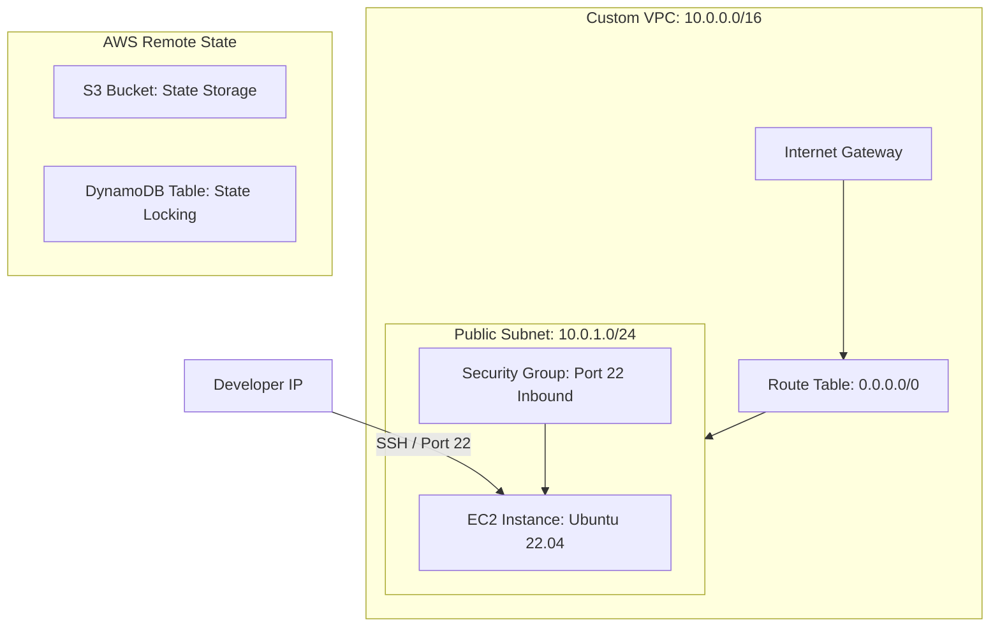

# AWS Terraform Infrastructure Bootstrap

This repository contains the Terraform configuration to bootstrap a professional-grade AWS infrastructure deployment. It sets up a secure remote state backend in S3 with state locking in DynamoDB, and provisions a custom Virtual Private Cloud (VPC) network running an EC2 web server.

## Architecture Diagram



## Features

- **Secure Remote State Backend**: State is securely versioned and encrypted in an AWS S3 bucket.
- **State Locking**: Concurrent execution prevention managed dynamically via a DynamoDB table.
- **Custom Network Topology**: Isolated VPC with public subnet, routing tables, and internet gateway.
- **Secure VM Instance**: EC2 instance dynamically querying the latest Ubuntu 22.04 LTS AMI and restricted to the developer's specific public IP address via Security Groups.
- **Infrastructure as Code Best Practices**: Fully parameterized inputs using `variables.tf` and outputs exposed in `outputs.tf`.

## File Structure

```text
├── providers.tf         # Terraform version, AWS provider, and S3 backend configurations
├── variables.tf         # Input variable declarations
├── outputs.tf           # Resource output definitions
├── terraform.tfvars.example # Template variable values (rename to terraform.tfvars and customize)
├── main.tf              # Resource definitions (VPC, Subnet, EC2, S3, DynamoDB)
└── .gitignore           # Safeguard rule configurations to prevent uploading sensitive data
```

## How to Run This Project

### 1. Prerequisites
- [Terraform CLI](https://developer.hashicorp.com/terraform/downloads) (>= 1.5.0) installed locally.
- [AWS CLI](https://aws.amazon.com/cli/) configured with appropriate IAM credentials.

### 2. Configure Variables
Rename the template variables file and customize with your parameters (e.g. S3 bucket unique name, your public IP):
```bash
cp terraform.tfvars.example terraform.tfvars
```

### 3. Initialize Workspace
Download providers and initialize local state:
```bash
terraform init
```

### 4. Create Backend & Network Resources
Deploy the S3 bucket, DynamoDB table, and VPC network:
```bash
terraform validate
terraform plan
terraform apply
```

### 5. Migrate State to S3 Backend
Uncomment the `backend "s3"` block in `providers.tf` and run the migration:
```bash
terraform init
```

### 6. Verify Connection
Check connectivity to the EC2 public IP using PowerShell:
```powershell
Test-NetConnection -ComputerName <EC2_PUBLIC_IP> -Port 22
```
